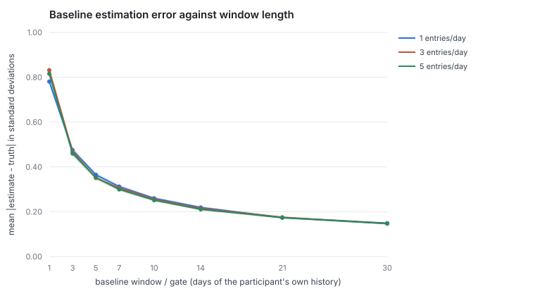
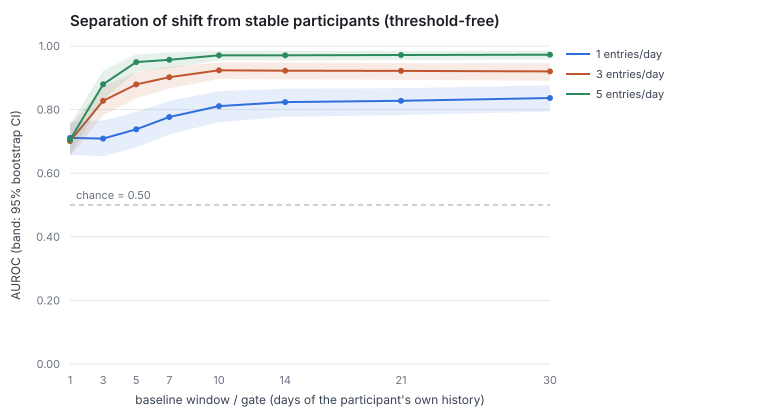
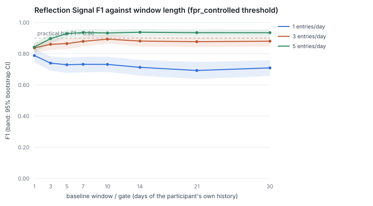
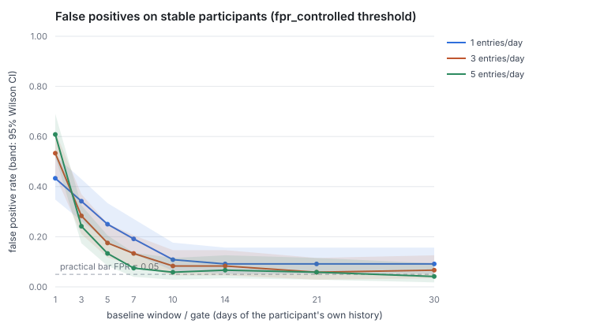

# How much data does a Reflection Signal need?

Answers with a measurement the question `MIN_REFLECTION_BASELINE_DAYS` and
`RAMP_UP_DAYS` have always answered with an assumption: **how much of a
participant's own history is needed before a reading is worth showing?**

The apparatus is 10,080 runs of the real pipeline against synthetic
participants whose answer is known in advance, sweeping the baseline window over
`{1, 3, 5, 7, 10, 14, 21, 30}` days and entry density over `{1, 3, 5}` entries
per day, 120 participants per condition.

- driver — `sentra/backend/scripts/run_data_sufficiency_study.py`
- generators and metrics — `sentra/backend/app/analytics/data_sufficiency.py`
- harness tests — `sentra/backend/tests/test_data_sufficiency.py`
- artifacts — [`assets/data_sufficiency/`](assets/data_sufficiency/):
  `runs.jsonl.gz` (every run), `cells.csv` (every condition), `summary.json`,
  four SVG curves

**`data_classification=synthetic` throughout.** The database is SQLite held in
memory for the process, every participant id is prefixed `synthetic:`, and
nothing touches Supabase.

## The finding in one paragraph

Fourteen days is right, and it is right for the reason the code never
claimed: the baseline estimation error curve is *exactly* sampling noise,
`0.798/√n` to within 2% at every window, and by the pre-declared plateau
criterion it flattens at 14. But the study did not find a data volume at which
the Reflection Signal clears the practical bar the epic set, and **the binding
constraint is not data volume**. False positives on stable participants stop
improving around day 10 and settle near 6–9%, because half the score of a
participant nothing happened to comes from two terms that do not distinguish
them from one who changed. More days will not fix that; the numbers naming those
two terms are the next thing to measure.

## Scope

Per the scope correction of 2026-08-09 on the epic, and #91:

- **`POPULATION_BASELINE` is not re-estimated and not restored.** Synthetic
  participants can say what an algorithm needs and where it fails. They cannot
  supply a population prior for real students, and a prior fitted to generators
  we wrote would be an assumption laundered through arithmetic. See
  `baseline_reestimation.md`.
- The constant proposal is limited to `MIN_REFLECTION_BASELINE_DAYS`, the
  window/data-quality policy, and an explicit decision about whether the
  evidence supports a change. It does.  It supports leaving the number alone —
  which is a result, not a non-result, because until now nothing had tested it.
- Variance/autocorrelation sufficiency for the L5 dynamics layer is #97, not
  this.

## Method

### The participants

Three personas, all drawn from one ordinary regime for their history:

| persona | evaluation day | ground truth |
| --- | --- | --- |
| `stable` | same regime as its history | **no signal.** Every signal here is a false one |
| `shift_moderate` | triggers and distress states ×1.6, protective structure ÷1.6, withdrawal 0.08 → 0.35 | **signal** |
| `shift_large` | the same knobs at ×2.4, withdrawal 0.08 → 0.70 | **signal** |

The ground truth is not a label attached to an output afterwards; it is the
parameter that produced the input. Effect sizes are measured rather than
asserted — at 3 entries/day, `shift_moderate` moves `state_count` by 1.05
baseline standard deviations, `trigger_count` by 0.69, `protective_ratio` by
−0.64; `shift_large` moves them by 2.39, 1.60 and −0.92. The full table per
density is in `summary.json` under `effect_sizes_in_baseline_sd`.

Node labels come from a small fixed vocabulary and recur across days —
consecutive days share about a third of their nodes. A fresh label each day
would have made every node look added and removed and inflated the
temporal-shift term for everyone equally.

### What is actually run

The real pipeline against real rows: synthetic entries are written as `Entry` +
`Extraction` + `GraphSnapshot` and `InferenceOrchestrator.process_day` is called
on the evaluation day. The gate, the baseline, the z-scores, the rule engine and
the score combination are the shipped code. Nothing is reimplemented, because a
study that reimplements what it grades grades a copy.

One production oddity is reproduced rather than corrected: every entry on a day
diffs against the *previous day's* last snapshot, and the orchestrator then
reads only the newest snapshot of the day. On a multi-entry day the rule engine
sees the last entry's graph while the aggregator has summed all of them.

### The counterfactual gate

`MIN_REFLECTION_BASELINE_DAYS` is `max(env, RAMP_UP_DAYS)`, so a window shorter
than fourteen days cannot be reached through configuration — the env var can
raise the requirement, never lower it (#91). Asking "would seven days have been
enough?" therefore requires patching both constants in-process, which the driver
does around each cell and restores afterwards. Production is unchanged.

### Pre-declared criteria

Fixed in the script before the sweep was run, in the spirit of #90:

```
practical bar        F1 ≥ 0.90 AND false-positive rate ≤ 0.05
read off             interval bounds, not point estimates
plateau              an added day buys < 0.01 sd of baseline accuracy
repetitions          120 evaluation participants per condition
threshold fitting    20 calibration participants, disjoint, window 14, densities pooled
```

120, not the 20 the epic asked for, because 20 cannot answer the question: a
Wilson interval on a *perfect* 0/20 still reaches 0.161, so at that size every
cell fails the 5% criterion by arithmetic rather than by performance. At 120 the
bar can be cleared by evidence — one false positive in 120 gives an upper bound
of 0.046.

### The threshold this study had to invent

**The product ships no decision threshold.** Nothing in the codebase turns
`final_score` into signal / no-signal. Precision and recall are undefined
without one, so two are fitted, once, on calibration participants no reported
number is computed from:

- `fpr_controlled` = 4.53 — the lowest cut holding calibration false positives to
  5%. The shape of the constraint the product actually has.
- `max_f1` = 3.88 — what an optimiser picks when told the classes are equally
  common and both errors cost the same. Neither is true.

Everything below quotes `fpr_controlled`; `cells.csv` carries both. **AUROC is
reported alongside every F1 because it does not depend on either**, and where
the two disagree, AUROC is the one that is about the pipeline.

## Result 1 — the baseline estimator is already optimal; only days help



Mean absolute error of the estimated baseline against the distribution it was
drawn from, in standard deviations — the bias the baseline puts directly into
every z-score:

| window (days) | 1 | 3 | 5 | 7 | 10 | 14 | 21 | 30 |
| --- | --- | --- | --- | --- | --- | --- | --- | --- |
| measured (3 entries/day) | 0.832 | 0.467 | 0.351 | 0.305 | 0.255 | **0.214** | 0.175 | 0.147 |
| `0.798/√n` | 0.798 | 0.461 | 0.357 | 0.302 | 0.252 | 0.213 | 0.174 | 0.146 |

The second row is the expected absolute deviation of a sample mean. The match is
within 2% at every window from 3 days up, which says something useful: **there is
no implementation slack to recover.** `estimate_baseline` is doing as well as an
unbiased estimator of a mean can do on n days, so the only lever on baseline
accuracy is n.

The curve is **the same at 1, 3 and 5 entries per day** (0.219 / 0.214 / 0.210 at
14 days). Writing more per day does not sharpen the baseline: the daily feature
values and their spread both scale with entry count, and the normalised error
cancels.

By the pre-declared plateau criterion the curve flattens at **14 days** at all
three densities — 10 → 14 buys 0.010 sd per day, 14 → 21 buys 0.006.

## Result 2 — detection plateaus by day 10, and the height of the plateau is set by density



AUROC, `shift_moderate` against `stable` — the harder and more realistic case:

| entries/day \ window | 1 | 3 | 5 | 7 | 10 | 14 | 21 | 30 |
| --- | --- | --- | --- | --- | --- | --- | --- | --- |
| 1 | 0.677 | 0.642 | 0.674 | 0.708 | 0.731 | 0.736 | 0.735 | 0.743 |
| 3 | 0.668 | 0.768 | 0.813 | 0.830 | 0.851 | 0.851 | 0.851 | 0.849 |
| 5 | 0.681 | 0.843 | 0.918 | 0.927 | 0.942 | 0.942 | 0.943 | 0.945 |

Read down a column rather than along a row. **Five days at 5 entries/day (0.918)
beats a month at 1 entry/day (0.743), and it is not close.** Days buy separation
until about day 10 and then stop; how much separation there is to buy is decided
by how much the participant wrote.

This is the cleanest dissociation in the study: **days determine baseline
accuracy, density determines detectability, and neither substitutes for the
other.** It also answers the epic's question of which variable matters — both do,
for different things.

For `shift_large` the same shape sits higher: 0.981 at (5 days, 5 entries),
1.000 at (10 days, 5 entries), and 0.930 at (30 days, 1 entry) — a month of
sparse journalling still separates an unmistakable change less well than a week
of dense journalling separates a moderate one.

## Result 3 — no cell clears the practical bar, and more data does not get there




`shift_large` clears F1 ≥ 0.90 on the interval bound from (5 days, 5
entries/day) onward, peaking at 0.980 [0.959] at (30, 5). `shift_moderate` never
clears it — its best is 0.872 [0.819] at (14, 5).

The false-positive rate is what fails everywhere:

| entries/day \ window | 1 | 3 | 5 | 7 | 10 | 14 | 21 | 30 |
| --- | --- | --- | --- | --- | --- | --- | --- | --- |
| 1 | 0.433 | 0.342 | 0.250 | 0.192 | 0.108 | 0.092 | 0.092 | 0.092 |
| 3 | 0.533 | 0.283 | 0.175 | 0.133 | 0.083 | 0.083 | 0.058 | 0.067 |
| 5 | 0.608 | 0.242 | 0.133 | 0.075 | 0.058 | 0.067 | 0.058 | **0.042** |

It falls steeply to day 10 and then stops falling. The best cell in the sweep is
0.042 — 5 stable participants in 120 — whose 95% upper bound is 0.094, still
above the 0.05 bar. **Doubling the history from 14 days to 30 does not move
it.** Whatever is producing those false positives is not a shortage of data.

## Result 4 — what is producing them

Three measurements, all in `summary.json` and `cells.csv`, that together explain
the floor.

**The temporal-shift term is at chance and carries a constant.** Graded on its
own, `temporal_shift_score` separates shifted from stable participants with
AUROC 0.54 (3 entries/day). Its mean is 2.46 on participants who changed and
2.32 on participants who did not. It enters `combine_hybrid_score` at weight
0.85, so it contributes about 2.0 to *everyone's* score — roughly two thirds of
a stable participant's total. A term that is nearly the same for both classes
cannot separate them; it can only move the threshold.

**`protective_decline` fires on half of all ordinary days.** Base rate on stable
participants, at every window: **0.506**. The rule triggers when
`protective_ratio < 0.2` *or* the previous day had more protective nodes — and
"yesterday had one more than today" is a coin flip for anyone. Rule hits are
weighted 2.0 in the combined score, twice the deviation term. `state_trigger_inflation`
fires on 0.272 of stable days at a 14-day window (0.456 at a 3-day window, since
a short baseline inflates z-scores). Only `isolation_spike`, at 0.064, behaves
like a detector.

**The deviation term alone separates better than the combined score.** At 3
entries/day, `shift_moderate` vs `stable`:

| window | 5 | 7 | 10 | 14 | 21 | 30 |
| --- | --- | --- | --- | --- | --- | --- |
| `final_score` | 0.813 | 0.830 | 0.851 | 0.851 | 0.851 | 0.849 |
| `deviation_score` only | 0.837 | 0.856 | 0.880 | 0.880 | 0.882 | **0.889** |

The combination is losing information at every window from 5 days up. The
weights in `combine_hybrid_score` (`rule*2.0 + deviation*1.15 + temporal*0.85`)
were chosen, never fitted, and this is the first evidence about them.

None of this is fixed here. It is the wrong change to make inside a study whose
own conclusions would then be measured against a pipeline nobody has shipped.

## Result 5 — the window *is* the gate

Measured, not read off the query (`--supply-check`, 30 participants, all arms
identical): a participant with 21 or 30 days of history produces **exactly the
same reading** as one with 14, because the orchestrator selects history with
`.limit(MIN_REFLECTION_BASELINE_DAYS)`.

So "days of history supplied", the epic's independent variable, stops being a
variable above the gate. That is a defensible default — a baseline that keeps
widening forever would eventually compare a student against a version of
themselves from another term — but it is currently a side effect of a query
limit rather than a stated policy, and the two constants cannot be tuned apart.

## What this recommends

### `MIN_REFLECTION_BASELINE_DAYS` / `RAMP_UP_DAYS` = 14 — confirmed, unchanged

For the first time with evidence behind it:

- baseline estimation error reaches its plateau at exactly 14 by the
  pre-declared criterion;
- detection AUROC has plateaued by day 10–14 at every density;
- the pre-#91 value of **3 is clearly unsupported** — 0.467 sd of baseline
  error, and false-positive rates of 0.24–0.53 depending on density.

10 days would cost little on these curves (AUROC identical, baseline error 0.255
vs 0.214). It is not recommended: the saving is four days of silence, the cost is
a 19% worse baseline on every subsequent reading, and the plateau criterion was
declared in advance precisely so a marginal case would not be re-argued after
seeing the numbers.

**No code change is proposed for these constants.** This document is the record
that they were tested.

### A data-quality signal the product does not yet have

Density, not days, decides whether a moderate change is detectable at all, and
nothing in `baseline_provenance` reflects it. A participant averaging one entry
a day sits at AUROC ≈ 0.74 *forever*; the current provenance block would report
them as `is_provisional: false, days_remaining: 0` — settled — on day 15.

Proposed, as a follow-up: carry entries-per-day over the baseline window in
`baseline_provenance`, and treat a sparse window the way a short one is treated.
The threshold for "sparse" should be measured on real usage, not chosen here.

### Follow-ups this study found and did not fix

1. `temporal_shift_score` — AUROC 0.54 at weight 0.85, contributing a ~2.0
   constant offset to every score.
2. `protective_decline` — 0.506 base rate on unchanged participants, at weight 2.0.
3. `combine_hybrid_score` weights — the deviation term alone outperforms the
   combination at every window ≥ 5 days.
4. `.limit(MIN_REFLECTION_BASELINE_DAYS)` — window and gate are the same number
   and cannot be set apart.
5. `event_avg_duration` — weight 0.08 on a feature that is 0.0 on every
   production day, since the extraction schema never asks for a duration.

## Limitations

**The generators are the study.** Every number here is conditional on
hand-written Poisson processes resembling students, and they were written by the
same person the study was written by. This supports a *floor* ("three days
cannot work even under favourable conditions") far more safely than a *ceiling*
("fourteen days is enough"), and the ceiling should be re-derived when real
consented data exists.

**The synthetic advantage is largest exactly where production is weakest.**
`isolation_signal` carries the biggest effect in the scripted shifts (3.1 sd at
moderate, 6.9 at large) — and in production it accumulates only from a Behavior
node labelled with the literal English string `isolation`. A Japanese entry
scores zero on it. Detection on real Japanese journals will therefore be *worse*
than these curves, by an amount this study cannot estimate. Same defect class as
#107 and D-01.

**F1 here is an upper bound.** Precision depends on how often a real change day
occurs, and the design fixes that at one shifted participant per stable one. A
day on which a student's state genuinely changes is far rarer than that, and at
a lower base rate the same false-positive rate buys much worse precision. AUROC
and the false-positive rate do not move with prevalence, which is why the
recommendation rests on them.

**A change is one day here.** Every shift lands on the evaluation day and is
graded on that day. Real deterioration is gradual, and a pipeline that reads one
day against a baseline is being asked an easier question by this design than by
life. `early_warning_dynamics.md` (#97) is where the gradual case lives.

**No clinical validity is claimed or tested.** This measures whether the
pipeline detects a change *it was told about*. Whether such a change matters for
a student is untouched. M-02 — no accuracy validation of any risk output — is
narrowed, not closed: what is now validated is that the pipeline responds to a
change in its own inputs, which is a precondition for clinical validity and not
evidence of it.

## Reproducing

Deterministic: every random draw is seeded from the run's identity, so a single
condition regenerates on its own and adding a persona does not move the data
under the others.

```bash
cd sentra/backend && python scripts/run_data_sufficiency_study.py --supply-check
```

About five minutes for 10,080 runs, rewriting everything in
`docs/assets/data_sufficiency/`. `--quick` is a smoke run and is not a result.

The full sweep is a manual runbook rather than a CI job: it takes minutes, and
what can regress in CI is the harness, not the sweep. `tests/test_data_sufficiency.py`
runs on every push and pins the properties the conclusions rest on — that seeds
reproduce, that the scripted shifts move the features the score is built from,
that the metrics are right on inputs whose answers are known by hand, that the
counterfactual gate really moves the orchestrator, and that
`MIN_REFLECTION_BASELINE_DAYS` is still floored at `RAMP_UP_DAYS`.

## Related

- `baseline_reestimation.md` — why `POPULATION_BASELINE` was deleted (#91)
- `early_warning_dynamics.md` — the exploratory dynamics layer (#97)
- `synthetic_evaluation.md` — the persona-based product evaluation this borrows its stance from
- `production_baseline_path.md` — the TypeScript port of the same baseline; the
  window and gate measured here apply to it through `shared/baseline_conformance.json`
