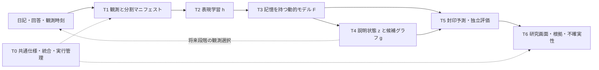

# 全体設計：内部状態、説明グラフ、観測を結ぶ

[入口](README.md) / 版 `research-plan-v1` / 実装前の仕様

## 問題と到達目標

現在の時系列グラフは、日記から抽出した記述と根拠を時間順に保持する。追加する研究エンジンは、その記録から未来の観測を予測し、予測に使った内部構造と説明グラフの一致を評価する。言語抽出、心理測定、予測、因果推論を別の評価対象として扱う。

## 既存コードの再利用

以下は基準コミットでの存在確認であり、本番稼働や有効性の認証ではない。

| 既存パス（リポジトリ相対） | 再利用する責務 | 今回加える責務 |
| --- | --- | --- |
| `sentra/backend/app/temporal/` | 日時・同一性・観測根拠の保持 | T1が学習データへの読取アダプターを作る |
| `sentra/backend/app/traversal/` | 根拠を返す決定的探索 | 比較対象と原文参照の入口に使う |
| `sentra/backend/app/analytics/dynamics.py` | 探索的な変動指標 | 将来予測とは区別して比較する |
| `sentra/backend/app/ontology/evolution/` | curated/personal/candidateの分離 | 学習候補はcandidate側へ接続する |
| `sentra/backend/app/policy/` | グラフ探索の環境・方策・評価 | 質問選択方策や心理動態モデルと混同しない |
| `sentra/backend/app/services/research_pipeline.py` | 既存の研究処理 | 初期は変更せず、T0の境界で接続する |
| `sentra/frontend/src/app/research/` | 研究画面の既存入口 | 新しい実験結果ページはT6の担当 |

`temporal/model.py` は自ら「data model, not a learned one」と明記している。新しい学習器を別モジュールに置き、この記述や既存の制約を消して実装済みに見せない。

## 内部モデルと説明の対応

履歴を $\mathcal H_t$、高次元の内部状態を $h_t$、解釈可能な状態を $z_t=\tau(h_t)$ とする。$h$ の各成分を、そのまま特定の感情と命名しない。$z$ の名前は測定との対応と評価の結果に基づく。

詳細モデルの遷移 $F$ と説明モデル $g$ に対し、$\tau(F(h,a))\approx g(\tau(h),\omega(a))$ を検証する。$a$ はモデル内操作、$\omega$ は説明モデルへの操作の対応。詳細側の変化を説明側でも再現することが「忠実」である。現実の人への介入効果の正しさは別の検証である。

説明状態が将来予測に十分でなければ、記憶状態や説明できない残差を明示的に保持する。圧縮した状態がマルコフ性を保つと最初から仮定しない。

## 72時間で通す経路と長期目標

| 要素 | 72時間の必須成果 | 次段階の研究 |
| --- | --- | --- |
| 観測 | 合成時系列、欠測、時刻、出典、分割の契約 | 許諾された実観測、測定不変性、報告過程 |
| 表現 | 数値観測を入力する小型の学習器、予測目標、保存と再読込 | 日記・自己評定を使う複数モダリティの予測表現 |
| 動態 | 持続値・線形モデルとの比較、学習する履歴モデル | 連続時間、複数時間尺度、semi-Markov、ジャンプ |
| 説明 | 学習した射影と疎な説明モデル、忠実度の測定 | 確率遷移・操作への忠実さ、構造の事後分布 |
| 高次相互作用 | 合成の積項を使う一つの比較実験 | 不確実性を伴う動的ハイパーグラフ |
| 観測選択 | 未対応なら能力フラグをfalseとし、契約だけ記載 | 情報利得を用いる質問選択と独立した実証 |
| UI | 実験出力を読む画面、未学習・不足・失敗の表示 | 許可された研究運用への接続 |

JEPA、AttnRes、GFlowNet等の名称は選択理由と比較条件がある場合に使う。名称を揃えることを完成条件にしない。Day 3の簡略化がどの仮定を変えるかを実験マニフェストに書く。

## データと権限の境界

観測、抽出された記述、内部状態、予測、候補グラフ、公開知識は別の型・保存先・表示を持つ。モデルの出力で観測履歴を上書きしない。モデルの確信度を文献の根拠強度に変換しない。

初回は合成データのみ。実データ入力は保存済みの利用許諾と対象者範囲をサーバー側で確認できるまで拒否する。既存の学習ゲートを設定の変更や削除で回避しない。研究画面へのアクセスはアプリの認証・研究権限で制限し、AIが出した状態を参加者・教育者の画面へ自動公開しない。

未来のデータで過去の推定を改善した結果をsmoothingと呼ぶ。予測時点で利用できたデータだけによるfilteringと分け、オンライン評価には後者を使う。

## 設計上の未確定事項

潜在次元数、モデルの規模、埋め込みモデル、補助質問、学習許諾、GPU枠は未確定。T0はH6までに合成実験用の小さな値と依存関係を記録する。値の選択を科学的に最適と表現しない。実データについては別の研究計画とデータ確保が必要である。
